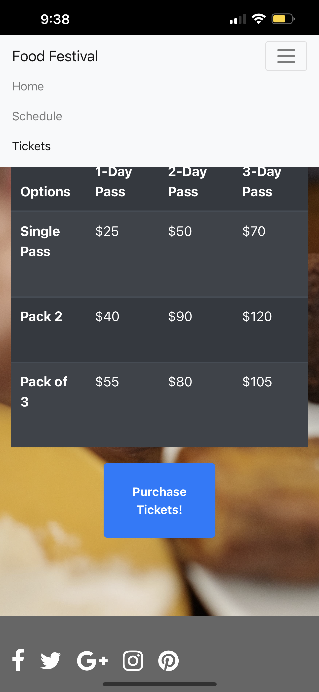
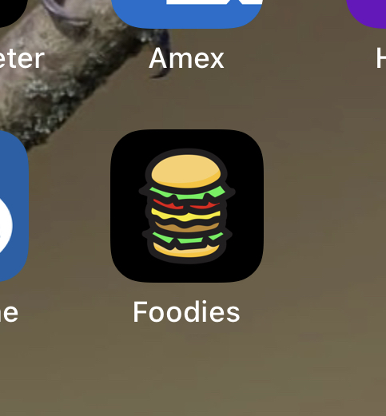
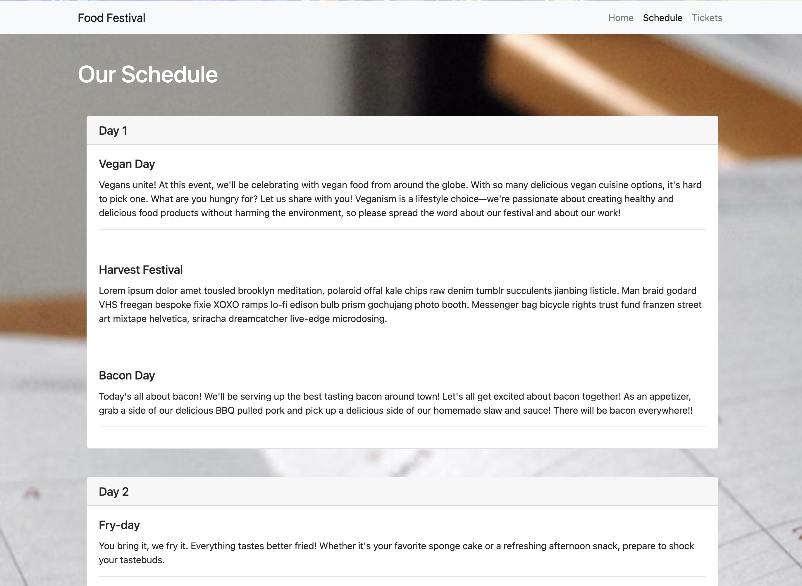
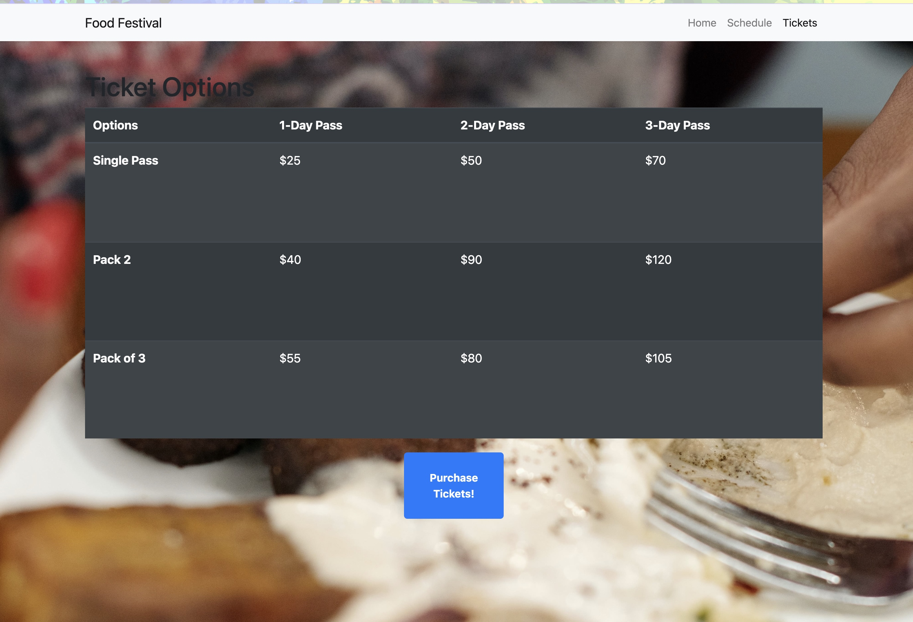

# Food Festival PWA

Food festival is my first progressive web application that I created, having offline capabilities and application download on the home screen. There is a make believe food social event in your town spanning across three days where you will be able to try various different cuisines. You have the option of buying a one, two, or three day pass for yourself, a friend, and/or a group with a maximum of three people. 

The main purpose for the creation of this application was to practice essential components for creating a progressive web application. Main focus was dedicated to installing and using various webpack packages, creating a service worker file, and creating a manifest file. 

### Tables/Models in Database
* Users
* Posts
* Comments
* Votes

### Link
https://cesarsiguencia.github.io/food-festival/

How to Install to Device Home Screen

- DESKTOP: Load site on Google Chrome and click on the small pop up icon in the url address bar to download as an application
- IPHONE: Load site on Safari, click on the Share icon below, then click on “Add To Home Screen”

### Screenshots

